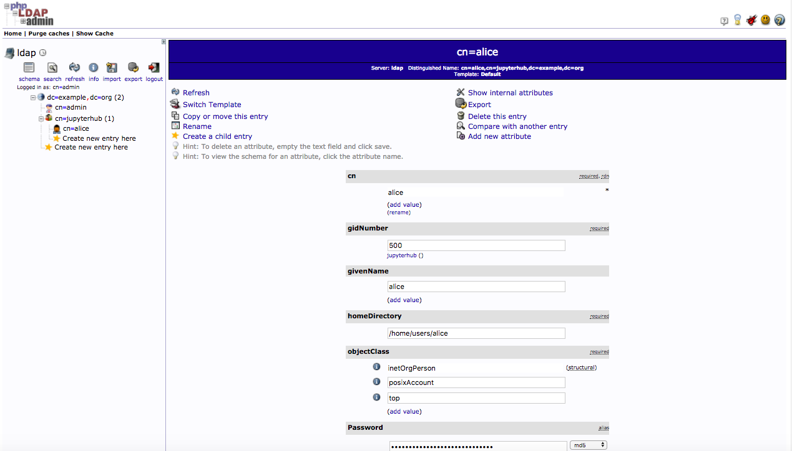
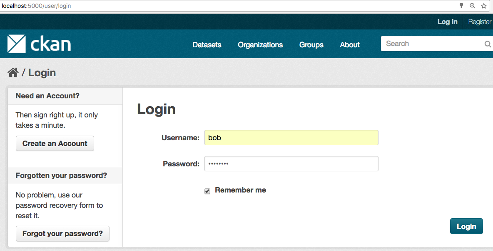

Ckan
============================================================

CKAN is an open-source DMS (data management system) for powering data hubs and data portals.
CKAN makes it easy to publish, share and use data. It powers datahub.io, catalog.data.gov and data.gov.uk among many other sites.

This guide will show you how to use Docker Compose to set up and run a `Ckan <https://ckan.org/>`_
 instance which uses ldap credentials to authenticate users. In particular, you can use an openLDAP docker container or a freeIpa instance.

OpenLDAP docker compose
-----------------------

This docker container allows us to start a simple LDAP server (`OpenLdap <http://www.openldap.org/>`_
) and a client (`phpLDAPadmin <http://phpldapadmin.sourceforge.net/>`_
). In particular, the docker compose downloads an initial database having domain *daf.test.it* and containing the user *bob* with password *password*.

Clone the git project:

.. code-block:: bash

 > git clone git@github.com:italia/daf-recipes.git

Run the docker container:

.. code-block:: bash

  > cd ./daf-recipes/ldap
  > docker-compose up -d

Check whether dockers are running:

.. code-block:: bash

  > docker ps
  e8ff9611aeff        osixia/openldap         "/container/tool/r..."   17 minutes ago      Up 17 minutes       0.0.0.0:389->389/tcp, 0.0.0.0:636->636/tcp   ldap
  6a0d0d6c3b9a        osixia/phpldapadmin     "/container/tool/run"    17 minutes ago      Up 17 minutes       0.0.0.0:80->80/tcp, 443/tcp                  phpldapadmin

**Note**

The docker compose requires that ports 80, 636 and 389 are available. If not, change them.

Now, open your favorite browser and type *http://localohost*. Login as *cn=admin,dc=example,dc=org* and password *admin* to navigate inside.

.. image:: imgs/ldap_login.png
   :scale: 50 %
   :alt: alternate text
   :align: right

FreeIpa Instance
-----------------------
We installed a FreeIpa server which can be used for test purposes. It can be reached to the address *91.206.129.245*

Ckan docker compose
-----------------------

Now that we have a ldap server up we can run the Ckan docker compose. It will run an instance of Solr, Postgresql, Redis and Mongo.

First we have to build some custom image:

.. code-block:: bash

  > cd ./daf-recipes/ckan
  > ./build_local.sh

Then edit the file *ckan.ini*:

- If you are using our openLDAP server:

   .. code-block:: bash

      # LDAP Intergration with ldap and ip address
      ckanext.ldap.uri = ldap://LDAP_IP:389
      ckanext.ldap.auth.dn = cn=admin,dc=daf,dc=test,dc=it
      ckanext.ldap.auth.password = admin
      ckanext.ldap.base_dn = cn=users,cn=accounts,dc=daf,dc=test,dc=it
      ckanext.ldap.search.filter = uid={login}
      ckanext.ldap.username = uid
      ckanext.ldap.email = mail
      ckanext.ldap.ckan_fallback = True

where LDAP_IP is the ip of the LDAP docker. To know the LDAP ip run:

.. code-block:: bash

  > docker inspect -f '{{range .NetworkSettings.Networks}}{{.IPAddress}}{{end}}' ldap
  172.22.0.2

We know that this is not the best approach to connect container among them (maybe it is the worst), we are using a deprecated compose file version (i.e. version 1 rather than using version 3), and we are using very heavy images. We will improve Ckan docker compose as soon as possible.

- If you are using our FreeIpa server
     .. code-block:: bash

      # LDAP Intergration with ldap and ip address
      ckanext.ldap.uri = ldap://91.206.129.245:389
      ckanext.ldap.auth.dn = uid=admin,cn=users,cn=accounts,dc=daf,dc=test,dc=it
      ckanext.ldap.auth.password = aiyaiPh8
      ckanext.ldap.base_dn = cn=users,cn=accounts,dc=daf,dc=test,dc=it
      ckanext.ldap.search.filter = uid={login}
      ckanext.ldap.username = uid
      ckanext.ldap.email = mail
      ckanext.ldap.ckan_fallback = True

Now that ckan container is up, type *http://localhost:5000* on your browser and login as user *bob* (password *password*).

.. image:: imgs/bob_page.png
   :scale: 50 %
   :alt: alternate text
   :align: right
