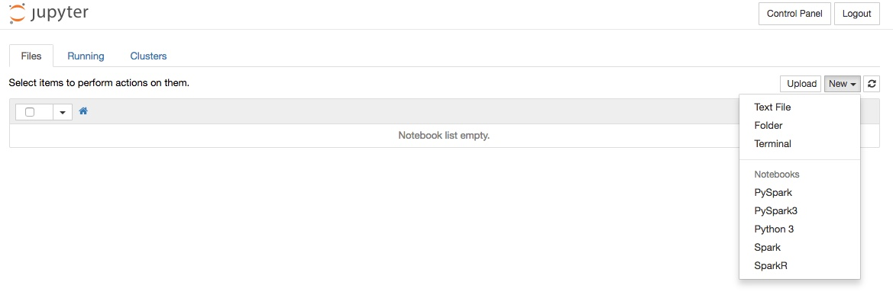
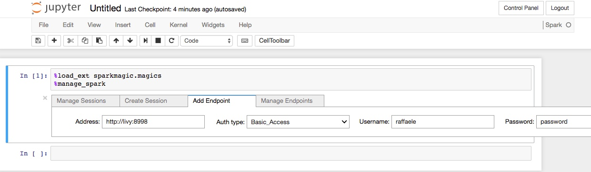
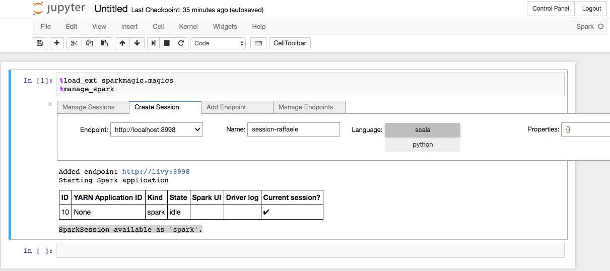
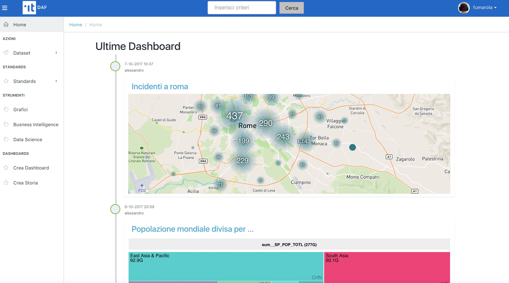
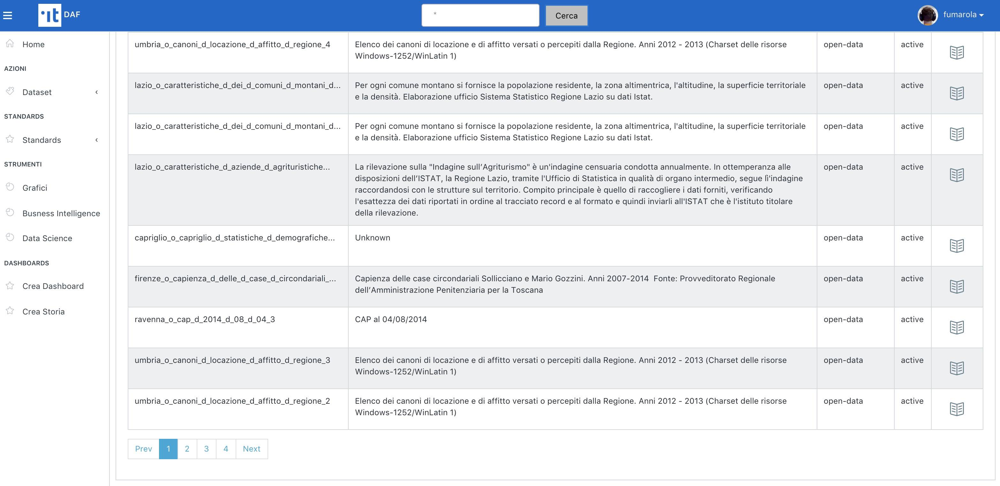
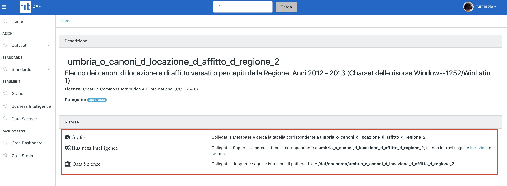
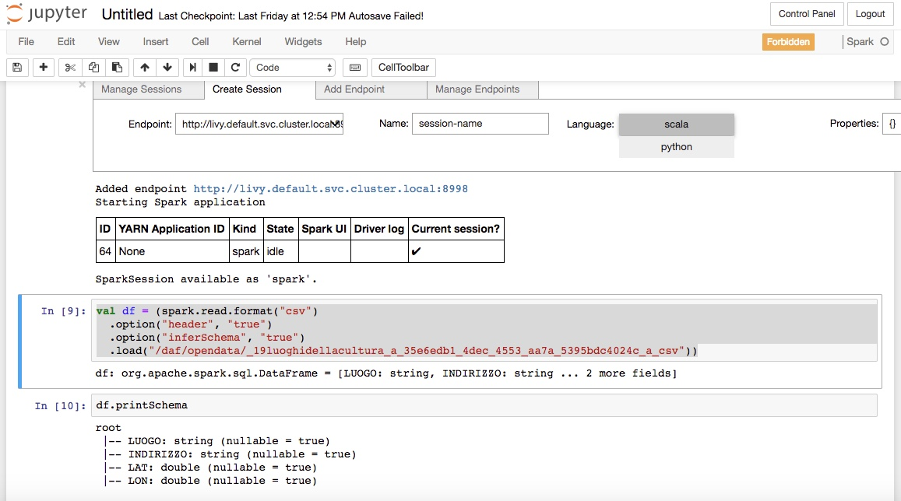

********************************
Datascience con Jupyter Notebook
********************************

============
Introduzione
============

`Jupyter Notebook <http://jupyter.org/>`_ è un'applicazione Web open-source che permette di creare e condividere documenti testuali interattivi, contenenti oggetti quali equazioni, grafici e codice sorgente eseguibile.
Jupiter è diventato uno standard de-facto per data scientist perché offre la possibilità di realizzare, documentare e condividere analisi di dati all'interno di un framework che supporta [1]_:

* operazioni di *data cleaning & trasformation*, simulazioni numeriche, modellazione statistica, machine learning e altro;
* l'esecuzione di applicazioni Scala e Python su piattaforme big data, grazie all'integrazione con Apache Spark.

A fronte di queste caratteristiche, Jupyter è stato scelto per essere uno degli strumenti messi a disposizione degli utenti del DAF.
L'obiettivo è quello di favorire l'analisi dei dati presenti nel DAF stesso e la pubblicazione su Web dei relativi risultati.

Questo breve *how-to* è pensato per fornire le informazioni basilari per configurare un notebook Jupyter utile per effettuare analisi sui dataset contenuti nel DAF utilizzando la capacità di calcolo di un cluster Spark.
Pertanto, qualora si intenda eseguire analisi gestibili su un singolo laptop, si consiglia di scaricare i dataset sulla propria macchina e realizzare le analisi localmente.
In tal caso si consideri che le analisi locali possono essere realizzate, oltre che con framework convenzionali quali R e Python (panda + scikit), anche con un'`istallazione locale di Jupyter Notebook <http://jupyter.org/install.html>`_.

=========================================
Creazione e configurazione di un notebook
=========================================
Per accedere alla console Jupiter del DAF collegarsi all'indirizzo :dafjupyter:`/`.
Una volta effettuato il login con le credenziali fornite per il dataportal, si avrà accesso alla propria home nella quale è riportato l'elenco dei notebook associati all'utenza (al primo accesso l'elenco sarà vuoto).

Per iniziare una nuova analisi è necessario creare un nuovo notebook scegliendo l'ambiente di sviluppo (*kernel*).
A tal fine cliccare sul pulsante 'new' in alto a destra e selezionare una delle seguenti voci dal menù a tendina:

* 'PySpark': Notebook Python 2 integrato con Spark
* 'PySpark3': Notebook Python 3 integrato con Spark
* 'Python 3': Notebook Python
* 'Spark': Notebook Scala integrato con Spark
* 'SparkR': Notebook R integrato con Spark

Una volta effettuata la selezione, Jupiter provvederà a creare un notebook del tipo selezionato e a visualizzarlo in una nuova scheda del browser.

La prima operazione da eseguire è la configurazione della connessione verso il cluster Spark del DAF.
A tal fine è necessario configurare l'accesso al server `Livy <https://livy.incubator.apache.org>`_, specificando l'endpoint del server, il tipo di autenticazione e le credenziali di accesso [2]_.

Per fare ciò è sufficiente copiare e incollare i seguenti comandi nel primo quadrante disponibile, ed eseguirli premendo la combinazione di tasti *[shift] + [invio]*:

.. code-block:: none

 %load_ext sparkmagic.magics
  %manage_spark

L'esecuzione dei comandi produrrà l'apertura di un pannello come mostrato in figura:

Cliccare nel tab 'Add Endpoint' e inserire le seguenti informazioni:

* Address: http://livy:8998
* Auth type: Basic_Access
* Username: *<il vostro username>*
* Password: *<la vostra password>*

Cliccando il pulsante 'Add Endpoint' la configurazione sarà aggiunta al notebook.

Dopo aver configurato correttamente la connessione al server Livy sarà possibile creare una *SparkSession*.
Per fare ciò:

* selezionare il tab 'Create Session';
* scegliere nel menu a tendina 'Endpoint' l'endpoint appena configurato (http://livy:8998);
* dare un nome alla sessione che si sta creando valorizzando il campo 'Name';
* selezionare il linguaggio che si intende usare nel notebook (ad esempio 'scala');
* cliccare il pulsante 'Create Session'.

Il sistema impiegherà qualche decina di secondi per attivere il collegamento con il cluster Spark.
Al termine dell'operazione il notebook è pronto per caricare dataset e realizzare analisi.

Se tutto è andato andato a buon fine, sarà visualizzata una tabella con le informazioni prodotte da YARN (il gestore delle risorse del cluster Spark) e la seguente frase conclusiva "SparkSession available as 'spark'.", così come mostrato nella figura successiva.

===================
Caricare un dataset
===================

Una volta attivata con successo una sessione Spark, l'ambiente è pronto per iniziare l'attività di analisi.
La prima cosa da fare è selezionare il dataset da analizzare in :dataportal-private:`/`.

Nella barra di ricerca in alto al centro è possibile inserire del testo per fare ricerca dei dataset indicizzati.

In alternativa, inserendo '*' verranno visualizzati tutti i dataset indicizzati dal DAF.

Premendo l'icona a destra di ogni risultato si accede alla scheda informativa del dataset (immagine di seguito), dove potete individuare le `uri` per accedere al dataset selezionato utilizzando gli strumenti di datascience del DAF.

Per creare uno Spark DataFrame con il dataset che si vuole analizzare, procedendo come segue:

* Identificare il dataset su :dataportal:`/` e tenere traccia del path e del formato indicati nella scheda informativa (vedi sopra). Nel caso in esempio, si è scelto il dataset 'abitazioni_d_ritirate_d_e_d_ultimate_d_per_d_numero_d_stanze_d_anno_d_2013_d_4e3f6d25_63'.
* Eseguire nel notebook il seguente comando, che chiede a Spark di creare un nuovo DataFrame contenente il dataset specificato:

.. code-block:: scala

   val df = (spark.read.format("csv")
        .option("header", "true")
        .option("inferSchema", "true")
        .load("/daf/opendata/abitazioni_d_ritirate_d_e_d_ultimate_d_per_d_numero_d_stanze_d_anno_d_2013_d_4e3f6d25_63")
   )

* [Optional] Eseguite il seguente comando per ottenere lo schema del dataframe:

.. code-block:: scala

   df.printSchema

A questo punto il notebook è pronto all'uso. Per approfondimenti sull'utilizzo di Spark e di Jupyter Notebook si rimanda alla documentazione ufficiale.

=====================
Risorse utili
=====================

 * http://spark.apache.org/docs/latest/sql-programming-guide.html
 * http://jupyter.org/

**Note**

 .. [1] Per una panoramica completa sulle funzionalità offerte da Jupiter e per l'elenco completo dei linguaggi di programmazione da esso supportati, far rifererimento al `sito ufficiale <http://jupyter.org/>`_.
 .. [2] Al momento l'autenticazione presso il server è necessaria ogni volta che si crea un nuovo notebook. Nelle prossime release del DAF, sarà fornito uno script che permetterà di effettuare questa operazione solo una volta.
