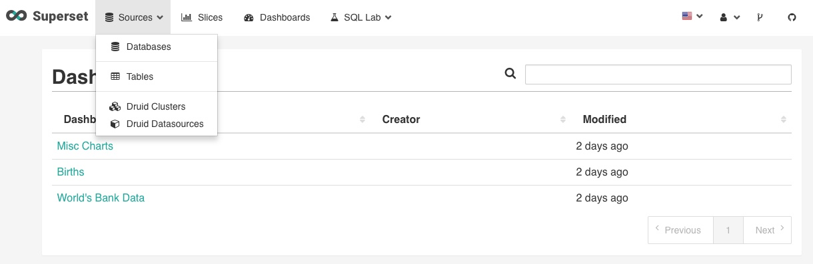
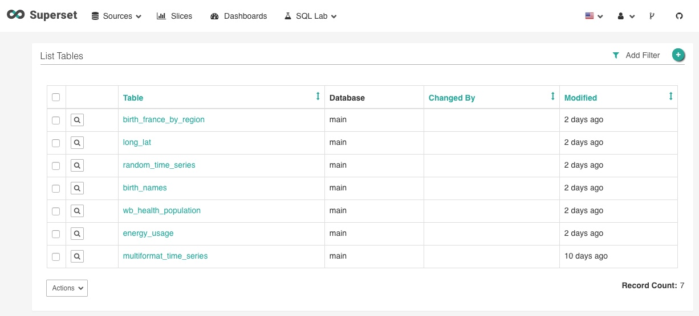
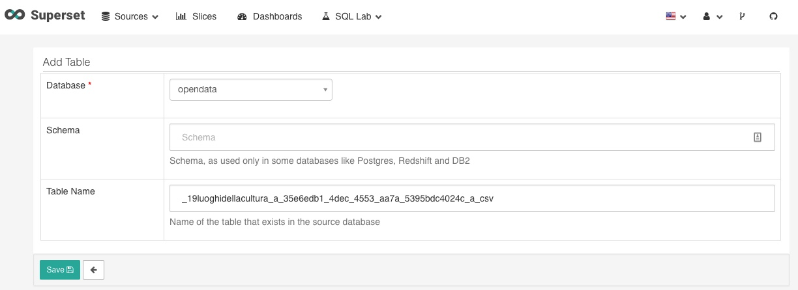
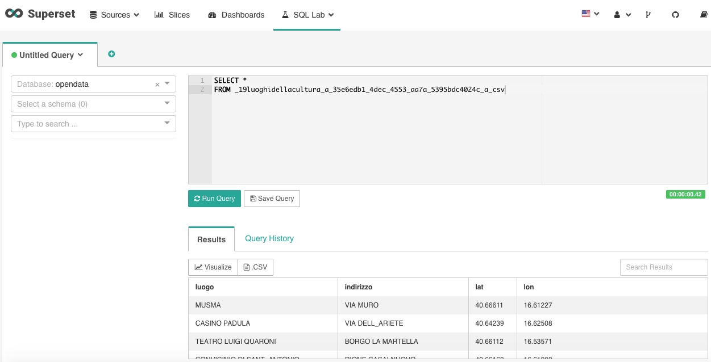
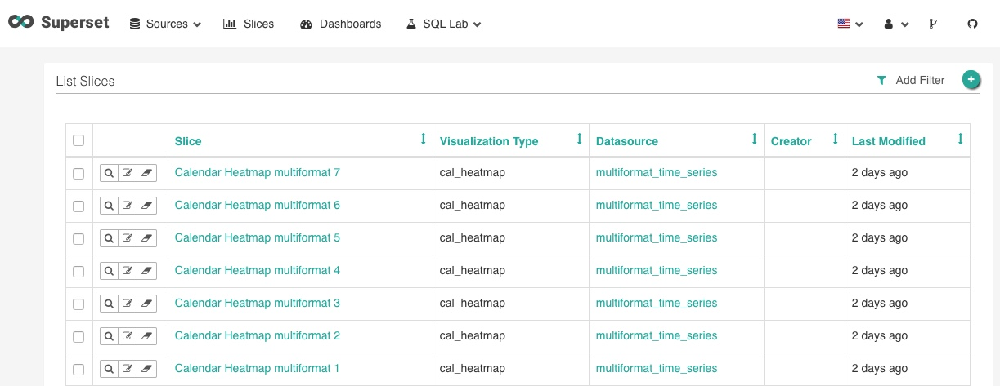
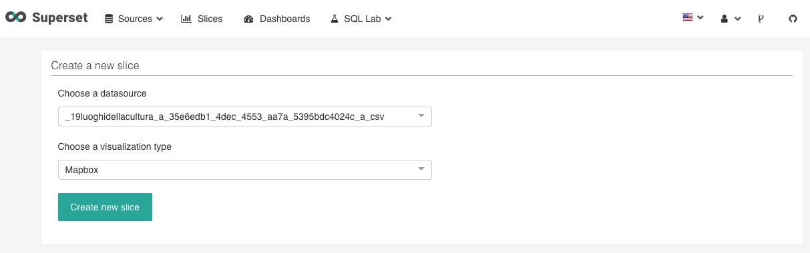
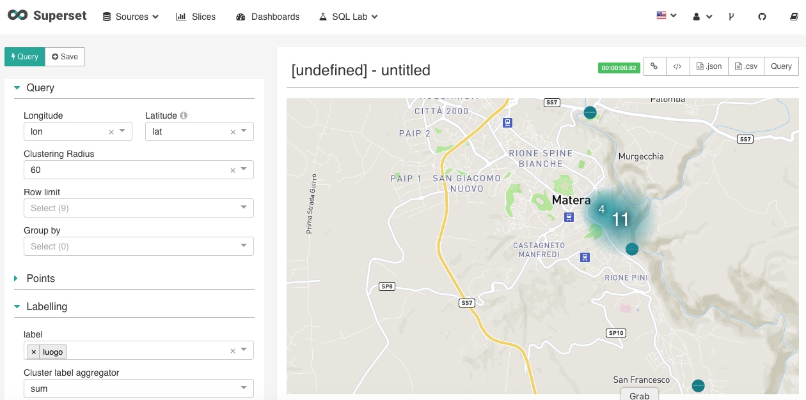
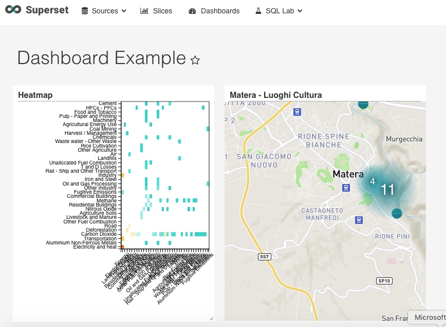

*******************************
Data Visualization con Superset
*******************************

Superset è un tool opensouce di Business Intelligence sviluppato da AirBnB con cui è possibile creare grafici ('slices' nel gergo di Superset), dashboard ed eseguire query SQL. Abbiamo integrato Superset con il DAF e il Dataportal per offrire agli utenti la possibilità di creare le proprie analisi e condividerle con la community in modalità self service. L'integrazione con il dataportal permette di creare datastories e dashboard che integrano le analisi salvate in Superset.

Questa sezione è pensata per guidarvi nel processo di creazione di tabelle e grafici. Si rimanda a tutorial più completi per informazioni dettagliate sulle potenzialità di Superset, che vi suggeriamo nella sezione 'Risorse Utili' di questa guida.

=================================
Configurazione - Aggiunta Dataset
=================================

Dalla sezione privata del Dataportal è possibile accedere a Superset cliccando su 'Business Intelligence' nel menu laterale. Si aprirà la vostra home che vi mostrerà la lista di dashboard create da tutti gli utenti della vostra organizzazione. Superset è offerto in modalità self service, per cui sarà vostra cura creare le tabelle che vi serviranno per le analisi e lo sviluppo di grafici e dashboard. Allo stesso modo, sarà vostro dovere non interferire con le analisi fatte da altri utenti nella vostra organizzazione, se non esplicitamente concordato con il rispettivo creatore.

Il primo step consiste nell'individuazione dei dataset oggetto di analisi. Nella home, cliccate nel menu in alto chiamato 'Sources' e poi su 'Tables'. Comparirà la lista delle tabelle già configurate (tra cui abbiamo mantenuto quelle di esempio nativamente presenti per vostra referenza). Cercate la tabella che contiene il dataset di vostro interesse, aiutandovi all'occorrenza con i filtri a cui potete accedere cliccando sul bottone in alto a destra 'Add Filter'.

Se non trovate la tabella di cui avete bisogno, dovrete crearla. Una volta individuato il dataset di vostro interesse utilizzando il dataportal, copiate il riferimento al dataset che trovate nelle schede di dettaglio del dataset. Ritornate su Superset e, nella sezione Tables su cui eravate, cliccate sul bottone '+' in alto a destra. Si aprirà la pagina 'Add Table' in cui dovrete selezionare il database di vostro interesse ('opendata' nel caso di esempio) e indicare il nome della tabella che sarà il riferimento che avete precedentemente copiato dalla scheda informativa del dataset. Infine, cliccate sul bottone 'Save' in basso a sinistra.

Nel caso in esempio, abbiamo selezionato il dataset dei luoghi della cultura di Matera.

================================
Esplorare un dataset con SQL Lab
================================

Prima di costruire un grafico, è consigliato analizzare il contenuto del dataset scelto. Superset offre nativamente una console per eseguire query SQL, a cui potete accedere cliccando su 'SQL Lab' e poi su 'SQL Editor'.

=================================
Creazione di un Grafico ('Slice')
=================================

Il prossimo step è creare un grafico con il dataset importato. Come abbiamo visto utilizzando SQL Analyzer, il dataset contiene informazioni georeferenziate sui luoghi della cultura di Matera, per cui potrebbe essere una buona idea di graficarli su mappa utilizzando l'ntegrazione con MapBox.

Cliccate sul menu 'Slices' posto nella barra in alto, comparirà l'elenco di slices già creati. Anche qui potete usare il sistema di filtri per cercare il grafico di vostro interesse. Per crearne uno nuovo, cliccate il bottone '+' in alto a destra.

Comparirà un menu dove dovrete scegliere la tabella da cui prendere i dati ('datasource'), e il tipo di visualizzazione a cui siete interessati. Nel nostro caso sceglieremo Matbox. Infine cliccate sul bottone in basso a sinistra 'Create New Slice'.

L'ultimo step consiste nel configurare il grafico. Nel caso in esempio abbiamo impostato le seguenti informazioni:

* latitudine e longitudine
* 'label' ovvero il testo che comparirà all'interno del punto disegnato sulla mappa
* 'Viewpoint' con le info di latitudine, longitudine e zoom di default che verranno utilizzate per la visualizzazione iniziale.

Infine, abbiamo eseguito la query che aggiorna il grafico, cliccando sul bottone 'Query' in alto a sinistra, e salvato la 'slice' cliccando sul pulsante 'Save'.

==========================
Creazione di una Dashboard
==========================

Le dashboard sono aggregazioni di 'slices' utili a tenere su un unico pannello i grafici di interesse. Per creare una dashboard in Superset occorre:

* Cliccare sul menu 'Dashboard' in alto
* Cliccare sul pulsante '+' in alto a sinistra
* Compilare i campi con le informazioni utili per la dashboard, come 'Title', 'Slug'(per rendere richiamabile tramite un url la dashboard), 'Slices' (in cui elencare le slices che si vuole utilizzare nella dashboard; nel caso in esempio abbiamo selezionato 'Matera - Luoghi Cultura' e 'Heatmap') e 'Owners' (in cui indicare chi puó contribuire alla dashboard).
* Cliccare il bottone 'Save' in basso a sinistra.

=============
Risorse utili
=============

Superset è un tool molto potente e, conseguentemente, complesso. Per utilizzare in pieno le sue funzionalità si rimanda a guide specifiche sul tema, di cui indichiamo qui alcuni riferimenti non esaustivi.

* https://superset.incubator.apache.org/
* http://de.straba.us/2017/08/15/creare-dashboard-con-superset/
