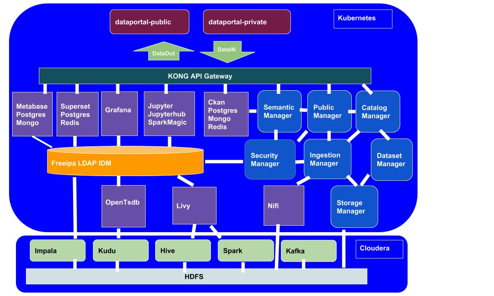

Overview
========

The DAF is an open source project meant to manage the data of a country's Public Administration.

Consequently, it is designed to:

* be highly scalable and configurable;
* promote data and knowledge sharing across several organizations;
* promote diffusion of open-data and insights of public interest;
* manage privacy and security issues;
* manage both batch and streaming ingestion and e-gestion processes.

The DAF is intended to support Public Administrations in developing:

* data-driven policies;
* data applications to improve public services and internal processes;
* innovative non-critical services for citizens and businesses.

Other users of the DAF are:

* data journalists looking for information to support their journalistic theses;
* citizens looking for information regarding the Public Administration;
* community of hackers, developers, and companies that use the tools to create value-added applications and services;
* the world of research and innovation. Thanks to the DAF, it is possible to promote initiatives to involve the world of research and innovation on issues of public interest.

The DAF is based on a security system, access management and data separation that allows you to manage data access permissions. In this way, all DAF features will be exposed to all types of users mentioned above. Users will only have access to the data for which the user profile they belong to has been granted access rights.

The following image provides an architectural snapshot of the DAF architecture:

In a few words, the DAF platform integrates:

* front-end applications (dataportal-public and dataportal-private);
* front-end open source platforms, developed by third-parties (e.g. Metabase, Superset, Jupyter, CKAN);
* back-end open source big data platforms and technologies (e.g. Hadoop ecosystem, Livy, Nifi, etc.);
* microservices to manage all underlying DAF mechanisms (e.g. Catalog Manager, Ingestion Manager, etc.).

Everything is deployed on a Kubernetes cluster and relies on a Cloudera cluster.

.. toctree::
   :maxdepth: 1
   
   Overview <index>
   Dataset concept <dataset>
   Interoperability, Standardization and Semantic <dataset_interop>
   End-user features: Dataportal & API <dataportal_api>
   How DAF helps Open Data <opendata>
